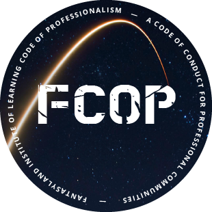

# FCOP

The home of FCOP, a code of conduct for professional communities.

 * [Fantasyland Institute of Learning Code of Professionalism](COC.md)
 * [Frequently Answered Questions](FAQ.md)

Please use this repository to submit issues and pull requests.

# Introduction

Every community makes decisions about who to allow into their community and about what types of behavior they permit. Code of Conducts (COCs) attempt to codify these decisions so that participants have a better understanding of what communities expect from them, and so community members can hold leadership accountable.

FCOP is a code of conduct designed specifically for _professional communities_. Professional communities, unlike social communities, political communities, religious communities, and support groups, exist to serve a professional agenda, not a social, political, religious or personal one.

Professional communities are inclusive and diverse. They do not take sides in religious or political matters. Above all, they are focused on ensuring that all civil individuals can come together and work productively in an environment that upholds the highest standards of professionalism, regardless of any differences between members that are inherent to pluralistic societies.

FCOP works well for professional events, open source projects, and other broad, open communities that are squarely focused on professional rather than social and personal goals.

To adopt FCOP in your professional community, you must pledge to uphold FCOP in your community and satisfy your obligations as described in FCOP.

As part of adopting FCOP, you may reproduce the text of [COC.md](COC.md) in any format you desire, or simply link to this repository with [FCOP large badge](badge-fcop.png), or the [FCOP small badge](https://img.shields.io/badge/FCOP-Adopted-0b4fbc.svg).

 

 

